# Taxi driver :taxi:


[](https://codecov.io/gh/Textualize/rich)

## Présentation

Le module `taxidriver` permet de modéliser le problème suivant [(Lien vers le sujet)](https://github.com/CDucloux/taxidriver/blob/master/Sujet.md) en termes de *graphe pondéré*.

> **VOCABULAIRE** : un graphe est dit *pondéré* lorsque pour chaque arête il existe un **poids** (durée) associée. 

Autre spécificité dans le cas présent : pour chaque arête $x - y$, il existe une arête $y-x$ (on peut parcourir la route dans les deux sens). 

Le module répond, par exemple, aux demandes suivantes :
- [x] Déterminer le chemin le plus court de la compagnie de taxi à l'aéroport
- [x] Déterminer les chemins les plus courts entre tous les points de la ville
- [x] Etudier l'impact d'un ralentissement ou d'une fluidification sur la route **9-13**
- [x] Les emplacements **(3,5,7,9,11)** sont en travaux $\Rightarrow$ Tout passage par un de ces lieux ajoute +1 minute au trajet

## Utilisation de la **Command Line Interface**

*Robert* est un "auto-driventrepreneur" qui gère sa nouvelle compagnie de Taxi. Jeune et ambitieux, il souhaite mettre à l'épreuve la concurrence pour s'imposer comme **LE** `Taxi Driver` de la ville  ! 

Pour cela, nous lui avons construit sur mesure une application en lignes de commande pour lui donner un avantage dûment mérité.

> /!\ Il faut d'abord s'assurer d'être dans l'environnement virtuel avant de lancer l'application. Voici comment procéder en utilisant un terminal :

- Ouvrez un terminal au niveau du dossier racine.

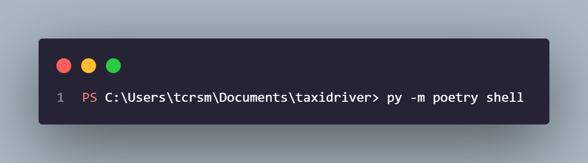

- Vous vous retrouverez alors face à cette fenêtre. L'indicateur en bas à gauche `(source-py3.10)` indique que vous êtes bien dans l'environnement virtuel.

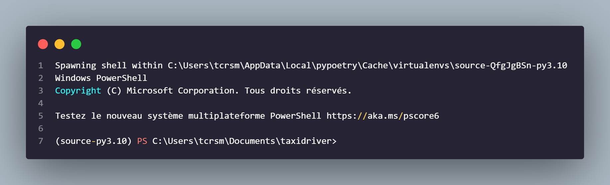

- Il faudra ensuite changer de répertoire : 

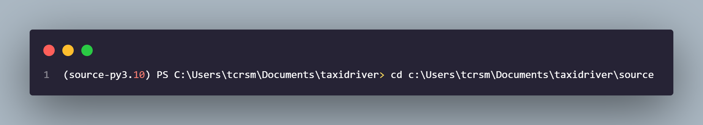

- Enfin, on peut lancer l'application et obtenir des informations sur les commandes disponiblles.

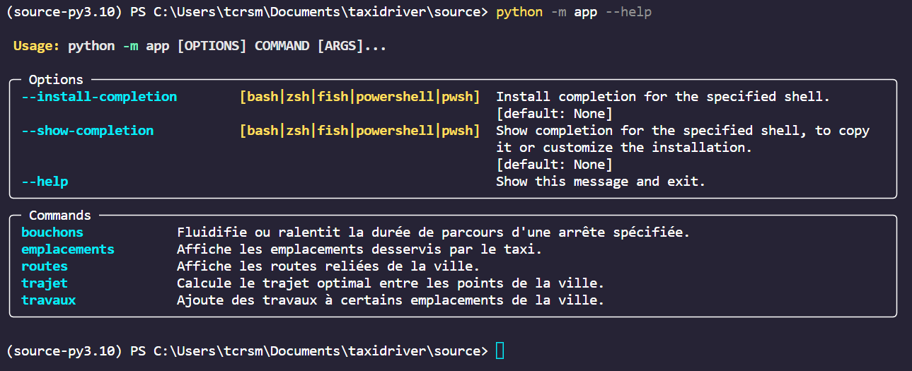


### Liste des commandes

```python
python -m app.py emplacements
```

- Affiche la liste des emplacements disponibles de la ville.

```python
python -m app.py routes
```

- Affiche la liste des routes reliant des emplacements de la ville ainsi que leur durée de parcours, sous forme de tableau.

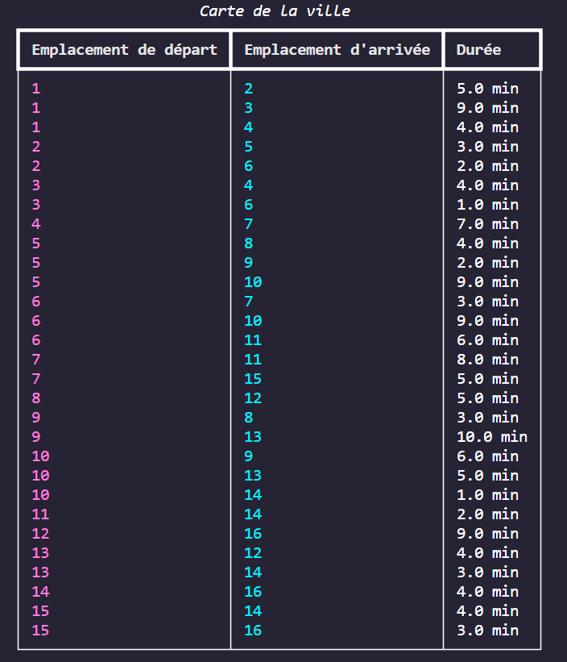


```python
python -m app.py trajet départ arrivée
```

- Calcule l'itinéraire et le temps de trajet optimal entre les points de départ et d'arrivée spécifiés.

*Exemple avec l'emplacement **9** et  **12*** :

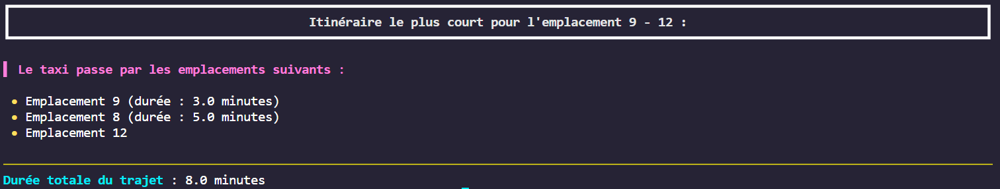

```python
python -m app.py bouchons départ arrivee durée
```

- Ajoute une durée de bouchon spécifiée par l'utilisateur sur une route. L'utilisateur peut ensuite recalculer un trajet. *(t/f)*
- Il existe une option `--fluidification` pour fluidifier la route plutôt que de faire des bouchons.

*Exemple avec l'emplacement de départ **1**, d'arrivée **2*** et de **7 minutes de bouchons** :

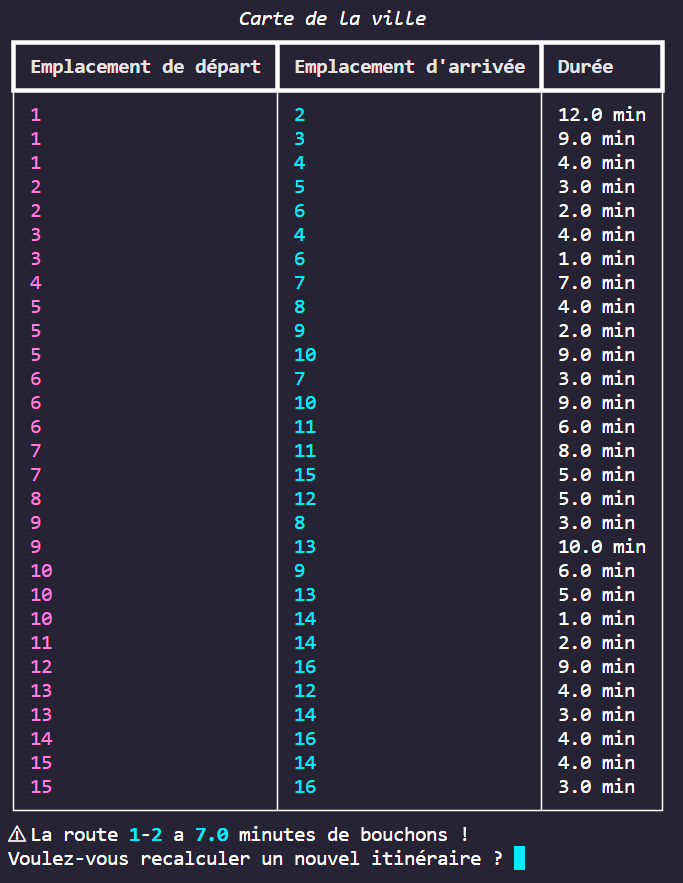

```python
python -m app.py emplacement_1 emplacement_2 emplacement_n durée
```

- Ajoute des travaux à un ou plusieurs emplacements avec une durée spécifiée par l'utilisateur. Il peut ensuite recalculer un trajet 

*Exemple avec l'emplacement **1,2,5,6** et  **2 minutes de travaux*** :

<p float="middle">
 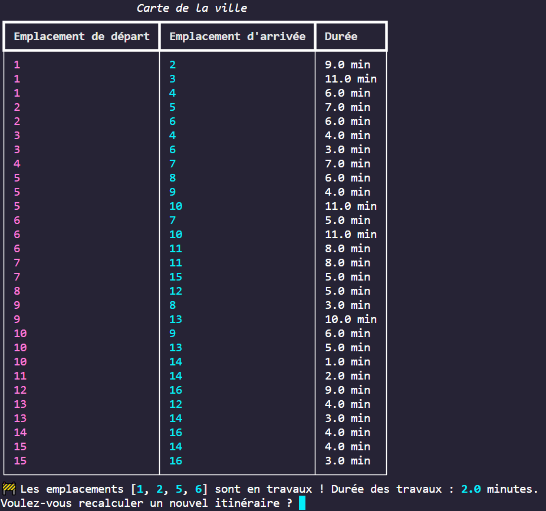
  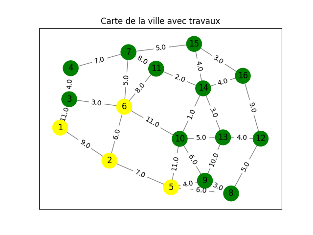
</p>

***

### Note sur l'option `--graphe`

Il peut aussi être assez pratique de visualiser sous forme de graphe, nous l'avons intégré par défaut dans la commande `travaux` mais l'option `--graphe` existe aussi dans les commandes `routes` et `trajet`

```python
python -m app.py routes --graphe
```

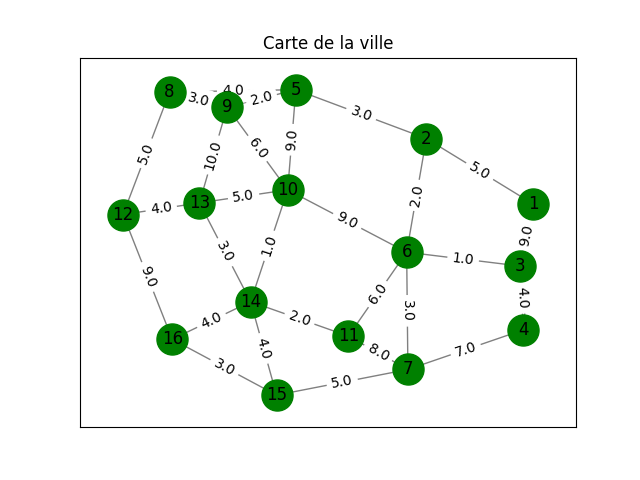

```python
python -m app.py trajet départ arrivée --graphe
```

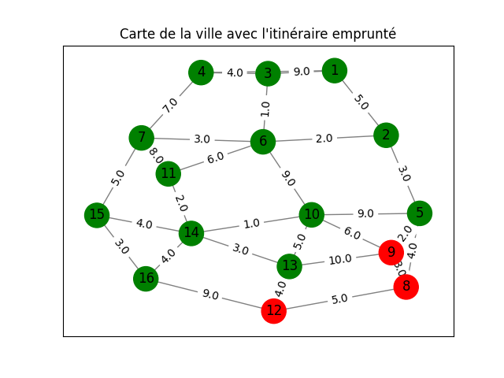

## Résolution

Un fichier <u>*notebook_résolution*</u> est disponible pour explorer plus en détail le fonctionnement des librairies de résolution `libtaxi` & `libformat`.

## Caractéristiques

- Module entièrement documenté sur l'interface publique et privée
- Formatage du code par `black` pour correspondre à la norme **PEP 8**
- Gestion des *dependencies* avec `poetry`
- Type checking avec `mypy`
- Création d'une `cli` avec `typer`
- Tests unitaires et tests d'intégrations avec `pytest` et couverture des tests avec `pytest-cov`
